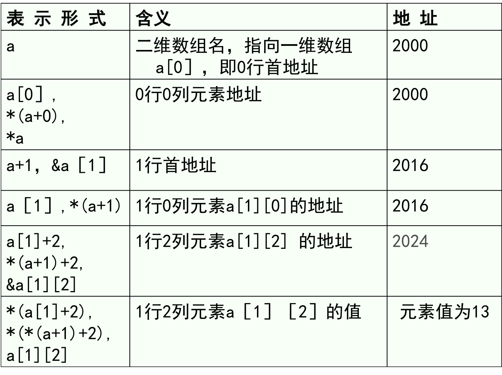

# C语言指针

32位处理器，有2^32个内存单元，即4GB。4G是虚拟地址，不是实际的内存大小，因而你的32CPU可以插入一个2G的内存条。

同理，64位处理器有2^64个内存单元，即4G个4GB。这是虚拟地址，不是实际内存大小，实际内存大小可能是插入的8GB内存条，或是16GB内存。

当程序运行时，操作系统会为每个程序分配运行所需的实际内存地址空间，这就是动态```地址转换``` 的过程，其过程为将虚拟地址空间转换到实际物理内存的过程。

相对的，如果一个8G内存的计算机玩大小为50G的游戏，此种情况为换入换出，即内存的```swap```机制，即换入换出。

***因而在编程时所说的地址，指的是虚拟地址，即虚拟地址空间。***

#### 64位 VS 32位 处理器

- 当是64位处理器时（AMD，Intel）

  ```c++
  int i = 5;
  long j = long(&i);
  printf("%lx",j);
  //输出结果为：7ffee068f718
  //即只使用了48位虚拟地址，48位虚拟地址相当于256TB，更高位的地址保留待用
  //但是
  printf("%ld",sizeof(&i));
  //输出结果为8，即指针变量为8个字节，即64位
  //综上就是，c语言已经兼容整体的64虚拟地址空间（64位），但是实际CPU厂商或当前C编译器只使用了48位。
  ```

  

- 当是32位处理器时，地址空间应该是0x00000001~0xFFFFFFFF，其中0x00000000保留位系统0。64位处理器，也可以通过兼容模式，来编写32位程序。

#### 小端模式与栈空间

以64位处理器(48位实际被利用)为例

```c++
int i = 5;
int j = 9;
long *pi = &i;
long *pj = &j;
printf("%lx\n", pi);
printf("%lx\n", pj);
/*输出结果为	 7ffee990b718 和 7ffee990b714
说明：
1. int占4个字节 
2. i先定义，j后定义，但是i的地址比j地址大，即栈空间向低地址方向增长

其次如果是结构体char 字段在 数据的中间定义，为了整存整取，char还是
会被对齐到int（4个字节）的位置，因而对齐方式没变，还是以4字节为单位
*/

printf("%d\n",*((int *)pi)); //将pi强转化成int*，然后解引用
// 输出5
t++;
printf("%d\n",*((int *)pi)); 
// 输出0
/*说明：
小端模式，即变量的高字节在虚拟内存的低地址空间存储。
*/
```

因而，若一个变量int i=5的地址为0x003a58fe（32位），他有指针变量int * p = &i，则p中存储的值为fe 58 3a 00。

### 虚拟内存地址空间

程序的虚拟地址空间有如下图结构

<div align="middle">

</div>

- .text，即代码段或正文段，存储可执行程序的二进制代码。
- .data，即数据段，存储在程序启动时已初始化的全局变量和字符串常量。
- .bss，即block stated by symbol，存储程序启动时未经初始化的全局变量和静态变量。
- 因而.代码段、数据段、bss段所占存储空间由编译器编译时分配
- stack，即栈空间，存储程序的临时变量，通常为局部变量，特点是地址从高地址向低地址分配；其次栈顶和栈的最大容量一般系统已经预定好了；还有就是所使用的空间，在函数撤销后会被系统自动收回，由自动化管理的特点；栈空间不大，所以当申请很大的空间时候不宜用栈，比如申请很大的数组空间、递归很多层的函数调用。
- heap，即堆空间。地址分配从低地址向高地址增长；分配空间是手动分配，手动回收的形式，不会自动回收，无自动化，因而如果没有手动释放堆内存空间，就会发生**内存泄漏**

### 定义指针

连续定义指针时**注意**

```c++
int a, b; //定义两个整型变量
int *p,q; //注意～～～～～p是整型指针，q是整型变量
//应该定义成
int *p, *q;
```

### 指针的解引用

取值运算符```*```优先级低于自增自减```++``` ```--```运算符。因而(* p)++，指先返回p所指内容，然后所指的空间的内容增加1，*p++，指取p所指的内容后p只向其后一个元素。

### 指针与函数参数

一个函数想改变调用者函数中的变量必须用指针。因为不同函数在栈区域都有各自的``` 函数栈空间```，函数栈空间参数传递采用值传递方式，因而 **改变函数内参数的值，不会改变调用参数的值**

若想通过调用函数来改变调用者的值，必须通过```指针```，进行传递。这种通过```参数指针```来修改原函数的参数成为```传出参数```。

```c++
#define OUT
void change(OUT int *p){
    //OUT没有实际意义，只是指明参数p为传出指针
    //作用是通过change函数来改变调用参数的值
}
```

多重指针与解引用的关系。```int a[3][4]```。

<div align="middle">



</div>

```c++
// 注意 区别
#include <stdio.h>
int main(){
	int a[4][5];
	printf("%lx\n",a); //输出 7ffeea6099a0
	printf("%d\n",sizeof(a)); //输出 80
	printf("%lx\n",a+0); //输出 7ffeea6099a0
	printf("%d\n",sizeof(a+0)); //输出 8
	printf("%lx\n",a+1);  //输出 7ffeea6099b4
	printf("%d\n",sizeof(a+1));  //输出 8
    printf("%d\n",sizeof(a[0]);  // 输出8
    printf("%d\n",sizeof(*(a+1))); // 输出20
	return 0;
    // 综上所述，如果一个指针不进行运算，则他就保持原来的属性，
	// 即原来是第几级，那么sizeof就是他这一级别的所有元素的总和
	// 但是一个指针一旦进行了运算，比如a+1，那么它的属性就会变成一个纯指针。
	// sizeof就是指针所占的空间大小，该处位64位系统，所以位8个字节
	// 一但解引用，它又变回了原来的整体概念，sizeof会包括所有这一级的元素
    // 但是a[0]不等于*(a+0)，而等于(a+0) ，因而sizeof(a[0])还是会返回指针的大小8
}
```

### 堆和栈

- 栈

  程序的变量，函数，都会在栈区域申请空间。此处申请的空间是**虚拟地址空间**，而操作系统将虚拟地址空间的栈空间映射到**物理内存**时，对应的物理空间也是连续的。例如申请一个int a[20]，这80个字节的空间在实际分配到的物理地址也是连续的。

  正因如此，栈空间的分配和使用比较高效。

- 堆

  程序通过malloc等函数开辟的空间属于堆空间，且分配到的堆空间在**虚拟地址空间**是连续的。但是，当操作系统将堆空间映射到实际物理内存地址时，**堆空间由物理上分割的碎片空间拼接而成**。因而对空间的开辟，连续性使用效率会低于栈空间。

  - 堆开辟

    ```c++
    #include <stdlib.h>
    void *malloc(size_t size);  //返回一个空指针，指向开辟堆堆虚拟地址空间首地址。
    // size_t 指int类型，一般表示空间大小。
    
    //因而开辟1MB的堆空间可以写成
    void * p = malloc(1<<20);
    ```

    堆开辟空间大小的上限是**物理内存大小**，实际工作中，开辟过大服务器堆内存需要向组织申请。

    开辟堆空间会出现的**问题**

    1. 开辟堆空间后没有```free(p)```，对于高频发的业务，内存会很快被吃空。

    2. 堆指针进行过运算后再free，即```p++; free(p)```，此时程序崩溃，因为内存释放范围出错。

    3. 丢失了堆首地址指针，如```p=p2```，这样的情况被称为**内存泄漏**，长期内存泄漏也会造成内存吃紧。

    4. free(p)后，虽然p指向的堆空间被释放，但是p变量中还是存储着堆空间地址值。因为free()函数的参数接收的是值传递p而不是&p地址，因而不能对p变量空间里的值进行修改。所以一般步骤是

       ``` c++
       void *p = malloc(5);
       free(p);
       p = NULL; //这步很关键，如果不赋值为空，p就成为-----野指针-----
       //对野指针误操作，会造成系统崩溃
       ```

       

    堆开辟，在操作系统实现上遵从：

    ***延迟分配，lazy model或写时分配***

    即只有当对对内存中存入实际内容是，malloc才会实际分配内存。

    ```c++
    #include<stdlib.h>
    void *p;
    while(1){
        p = malloc(1<<20);
    } //该循环不会崩溃，lazy model
    
    int * p1;
    while(1){
        p1 = (int *)malloc(1<<20);
        *p1 = 5;
    } //该循环很快会崩溃，即malloc分配不成功，不是指内存泄漏问题。
    ```

    

 ### 指针数组，数组指针，二级指针

- 数组指针，即一个指针指向一个数组

  ```c++
  int a[3][5];
  int (*p)[5];
  p = a; //因为[]优先级比*优先级高，因而需要加()。
  // 这定义的是一个指针p每个指针指向一个int[5]
  
  void func(int (*p)[5], int row); //定义一个函数，需要传递一个数组指针，参数[5]必须指明；
  //或是
  void func(int p[][5], int row);
  // row代表多少行。
  ```

- 指针数组

  ```c++
  int a[3][5];
  int *p[5];
  p = a;  //*先与int和p结合，即p是一个数组名，其中每个元素为整型指针
  ```

- 二级指针

  ```c++
  //二级指针的使用场景，就是通过调用函数，来改变原函数的指针。
  int a = 5;
  int b = 6;
  int *p = &a;
  int *q = &b;
  void swap(int **m, int **n){ 
      int * temp;
      temp = *m;
      *m = *n;
      *n = temp;
  }
  swap(&p,&q);
  ```

  ```c++
  //另一种使用场景，二级指针的使用场景。二级指针完美等价指针数组
  int *a[4]={"How","are","you",NULL}; //a为一个数组名，数组的元素为整形指针，因而a等价于二级指针
  int ** p ;
  p = a;	//此处正确
  int i = 0;
  while(*p!=NULL){
      puts(*p);
      p++; //此处正确，因为a是数组名，是常量，不能进行运算和赋值。而p是变量，可以进行++操作
  }
  ```

  

