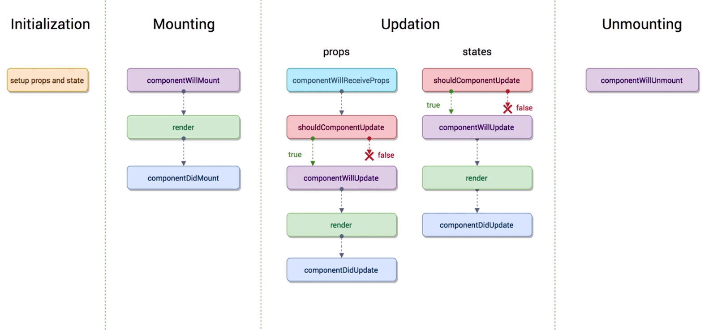
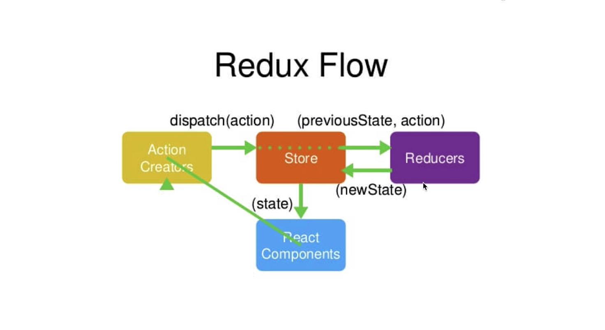

# React

react是一个灵活的，组建based的前端框架

## 创建一个简单的工程

```bash
npx create-react-app my-app # 创建一个工程，名为 my-app
npm run start # 启动程序
```


## React 项目目录结构

### React 的项目结构

```bash
tree -L 1
.
├── README.md       # 项目的说明问津
├── node_modules    # 项目所依赖的第三方包
├── package.json    # 脚手架工具的 一些包的信息介绍，类似于conda，包管理软件的的list列表
├── public          # 由脚手架工具生成的文件夹，即实际显示的页面
├── src
└── yarn.lock     # 项目依赖的安装包，以及他们的版本号和他们的源
```

###  JSX 语法

- 写在``.js``中的标签都可以称之为``JSX语法``。JSX语法的内容不是字符串，所以不需要在外围添加``""``

- ``JSX``语法通过定义一个类组件来使用。

    ```react
    class App extends Component {   // 定义一个组件App（类），继承Component父类
        render() {                  // 该类必须实现一个方法 render
            return (        // 该方法必须返回一个 JSX语法定义的 HTML标签内容。() 可以使得我们在多行内编写JSX语法
            	<div> hello world </div>   // 在render返回值中定义的JSX语法内容
            )
        }
    }
    ```

    #### 使用组件

    ```react
    // index.js 文件
    ReactDOM.render(<App />, document.getElementById("root")); // <App /> 又是一个JSX语法定义的标签，表示此处使用App 自定义组件。添加到root HTML节点处
    ```

    #### 父组件的值传递给子组件

    ```react
    // 组件的数据传递
    <App content={item} 
         index={index}  // 将item数据传递给子组件, index 表示该组件是list中的第几个。用于删除时定位
         deleteItemFunc={this.handleItemDelete}  // 传递父组件中删除的方法
         /> 
    // 在子组件中,通过props来获得内容
    <div>{this.props.content}</div>
    ```

    #### 子组件传值给父组件

    ```react 
    // 子组件
    // 在子组件中定义一个事件，即点击子组件父组件删除该子组件。等价于向父组件传值
    class TodoItem extends Component {
        // 由于所有的数据流都是从 树根节点向子节点流动。要想子节点操作父节点的list，来删除item。则需要父节点
        // 定义一个删除函数，并当作数据将函数传递给子组件
        render() {
            return <div onClick={this.handleClick}></div>
        }
        handlerClick() {
            this.props.deleteItemFunc(this.props.index) // 调用父组件传递过来的删除方法，
            // 并传递index给该方法，来定位删除对象。但是此时，这种写法是错误的。
            // 因为 this.props.deleteItemFunc，等价于父组件中的 this.handleItemDelete。
            // 而 父组件中的 this.handleItemDelete 与 子组件中的 this，不是同一个this
            // 所以在父亲组件中，传递方法时候写成
            // deleteItemFunc={this.handleItemDelete.bind(this)}  即可
        }
    }
    ```

    ```react
    // 父组件，中的删除方法
    
    handleItemDelete(index){
        ....  // 删除list中的方法
    }
    
    ```

    

- 自定义组件，组件名字必须用大写，如``<App />``，他就是一个自定义标签，不同于``<div>``等标签。同时，一般大写开头的JSX语法标签，都是组件。

- 组件``render``的时候返回的必须是一个组件，不能有多个并列的组件同时被返回。因而可以用``Fragment``占位符

    ```react
    import {Fragment} from 'react';
    ```

- JSX 注释

    ```react
    {/* JSX注释 1*/}
    {
        // JSX注释 2
        // JSX注释 3
    }
    ```

    

### 响应式和时间绑定

我们在也不用关注``dom``层的操作，只需要关注``数据层``的操作。react就会自动的生成dom的操作，并执行。

一个组件（一个类），可以也需要有自己的数据

```react
class TodoList extends Component {
//--------------------------------------------
    constructor(props){    // ES6，类的固定构造函数
        super(props)       // 初始化 父类
        
        this.state = {  // 该组件的状态数据。 这就是数据驱动的核心。该数据被存在该组件的this 的state属性中
            inputValue: '',    // 定义了两组数据，内容为空字符串、空数组
            list: []  
        }
    }
 //--------------------------------------------
    render(){
        return (
            // input标签，使用了该组件，状态数据中的 inputValue来初始化其 value属性。
            // 即赋值inputValue 给标签input。在JSX语法中，要使用JS的变量，必须添加一个{}，如下
            // 如果数据发生了变化，也面也就自动的发生了变化
            // 同理button
        	<div>
            	<input value={this.state.inputValue} />  
                <button>提交</button>
            </div>
        )
    }
}
```

一个组件，也可以监听一个标签的事件

```react
class TodoList extends Component {
//--------------------------------------------
    constructor(props){   
        super(props)     
        
        this.state = {  
            inputValue: '',   
            list: []  
        }
    }
 //--------------------------------------------
    render(){
        return (
            // 该组件，监听onChange事件，用来监听input输入框的变化，并响应。同理，在JSX中添加JS语句，需要用到 {}
        	<div>
            	<input value={this.state.inputValue} 
                       onChange={this.handleInputChange}
                 />  
                <button>提交</button>
            </div>
        )
    }
 //--------------------------------------------
    handleInputChange(e){    
        // 定义该事件的处理方法，可以接受一个Event 参数。e 中有个target属性，返回此标签
        console.log(e.target.value);
        // 改变组件的值
        this.state.inputVaule = e.target.value // 这句话执行不成功。因为 this 是undefined
        // 因为在 JSX 语句处 onChange={this.handleInputChange}时 没有对handleInputChange方法的 this属性进行绑定。
        // 因而可以在JSX语法处，添加 this.handleInputChange = this.handleInputChange.bind(this) ，即把 this绑定给handleInputChange 函数
        /////////////// 
        // 此时你还是没有改变input标签中的值，因为 组件中的state属性，是只读的，不能通过直接赋值的方式来实现。
        // 只能通过 setState方法来改变
       this.setState({ 
           inputVaule: e.target.value
       })    
        // setState 可以用接受两种参数，第一可以直接是一个状态值对象， 第二个可以接受一个回调函数，用于异步操作。例如
        this.setState((prevState)=>{}) // 它可以接受一个参数，表示之前状态的state，即this.state 的之前状态
    }
}
```


##    Props, State, Render

### Props

``props``表示组件的属性，一般用作``标签属性传递 ``   

```react
<App content={item} index={index} /> // 这里App组件的 props属性就包括 content, index两个
```

虽然这样可以从父组件中传递值给，子组件(props)。但是父组件可能传递过来的值不符合预期。例如，父组件应该传递函数引用，结果传递过来一个字符串。这样会在大型程序中会造成Debug的困难。因而有，``属性类型校验``。

```react
import PropTypes from 'prop-types'  // 脚手架工具中，自带的数据类型校验模块

TodoItem.propTypes = {   // 对 TodoItem 的属性做校验
    content: PropTypes.string,  //表示 props.content 属性，应该校验为 string 类型
    deleteItem: PropTypes.func,  
    index: PropTypes.number.isRequired // isRequired 表示必须传递数据，不能省略
    content1: PropTypes.arrayOf(PropTypes.number, PropTypes.string) // content1属性是一个数组，该数组中的值可以是number 或是string类型
    content2: PropTypes.oneOf([PropTypes.number, PropTypes.string]) // content2属性只可能是这两种类型中的一种
}
// 用于开发模式，一般不用于生产模式。他能校验属性数据传递后的类型
```

除了属性校验，还可以设置``属性默认值``，这样父组件如果没有传递某个属性值给子组件，子组件也能很好的运作。

```react
TodoItem.defaultProps = {
    index: 0,               // TodoItem组件中，index是必传的，所以可以为该属性定一个默认值
    content: "hello World" 
}
```

### state

``State``，组件的固有属性，类似于``类的成员变量``。它是在函数初始化时候定义的变量。是组件固有的属性

```react
class App extends Component {
    constructor(){
        this.state = {    // 初始化函数定义的 state 属性
            list:[],
            name: 'myApp',
        }
    }
}
```

### render

``render``函数，是用数据来渲染页面的函数，是每个组件必须有的函数。

- 当一个组件的``props``或``state``属性发生改变时，该组件的``render``函数就会被执行。

- ``父组件的render``执行时，挂载在其下的所有子组件的``render``都会被重新执行。

- 执行render的效率很快。主要是利用了``虚拟DOM``技术。虚拟DOM实际上就是虚拟的DOM节点，该节点不是完整形态的节点。它是一种js的对象，有点像json。在更新render时，变化前和变化后的虚拟DOM进行比较。用虚拟DOM（类似js的结构）进行比对，可以提高性能。最终只将修改的部分进行替换，然后生成最终的DOM结构。

    ```react
    // 虚拟dom
    <div id='abc'><span>hello world</span></div>  //这个react dom元素的 虚拟dom结构如下
    // ['div',{id: 'abc'},['span',{},'hello world']]
    // 虚拟dom 是个三元组 （标签名，标签属性对象，innerHTML子标签
    // 这种结构很容易做比较。 比较算法为 diff 算法
    ```

### 虚拟DOM及更新

执行流程

> 组件constructor 
>
> --> 调用render函数渲染页面
>
> --> render函数将JSX语法定义的模版结合数据后，转换成 虚拟DOM(JS对象)，等价于React.createElement('div', {}, 'hello world') 
>
> --> React 根据虚拟DOM(JS对象) 生成真实的DOM，并通过ReactDOM模块添加到 html中
>
> --> State, Props改变以及其父组件render调用
>
> --> 本组件render重新调用
>
> --> 生成新的虚拟DOM
>
> --> 比对旧 虚拟DOM 和 新 虚拟DOM差异，并分析差异
>
> --> 分析差以后，根据已经创建好的真实DOM，选择性修改真实DOM的部分内容。  $$$ 此处才是提高性能的关键，因为频繁调用和比对真实DOM的性能损耗很大
>
> --> 得到新的真实DOM后，在重新渲染html内容

### Diff 算法

diff 算法比较前后两个不同状态的 虚拟DOM。虚拟DOM树比较的时候：

- 同层比较
- 根据key值比较

## Ref

ref是react中JSX的一个引用节点，例如

```react    
<input
    ref={(myinput)=>{this.input=myinput}}   // 在JSX语法中，定义一个ref属性，该属性被赋值为一个函数，
    // 该函数可以接收一个参数来指向本 DOM节点自身。 后面通过 this.input = myinput，使得本节点获得一个属性this.input。它指向自身DOM 
  />

changeItem(){
    const value = this.input.value.  // 如果用onChange指向changeItem 函数。this.input.就等于该input本身。等价于该函数的 event.target
}

```

React 官方推荐，尽量**不要**利用 ref属性。因为React 规定数据流是单向的。该方式类似于c语言中的 goto，会打乱数据的流向


## 生命周期函数



### 概念和定义

上图每个函数都是生命周期函数。生命周期函数是指在某一个时刻，``组件会自动调用执行的函数`` 。

1. 当一个组件被创建，initialization 部分的生命周期函数会被执行，即``constructor``被执行，用来定义和初始化 props 和state
2. 当组件被创建好之后，需要进行第一次渲染之前。需要将组件挂载在dom节点上时，``componentWillMount``会执行。 React17版本后，过期
3. 之后第一次渲染``render``生命周期函数被执行。``render``函数是唯一一个必须实现的生命周期函数。
4. componentWillReceiveProps比较特殊，它在两个情况下执行。1 一个组件要从父组件处接收参数 2.**只有**父组件render函数被**重新**执行了，该生命周期就会执行（即改组件已经存在了，然后父组件有被render更新，它才执行）
5. 同理各个生命周期函数

### 使用场景

1. 默认情况，当父组件render时，子组件也会render，即使子组件的数据没有发生任何变化。因而可以在子组件中添加``shouldComponentUpdate 返回false``，来限制子组件的更新。当子组件挂载时，执行一次render之后，就不在进行render了

    ```react
    // 第一种写法
    shouldComponentUpdate(){
        return false; // 无条件不更新render
    }
    // 第二种写法
    shouldComponentUpdate(nextProps, nextState){
        // 可以接收两个数据，来对比现在的状态和更新后的状态。通过对比，如果发现数据没有变化，则不更新
        if(nextProps.content === this.props.content)
            return false;
        else
            return true;
    }
    ```

2. 异步操作（Ajax获取数据）。在组件挂载时，异步获取数据。``componentDidMount()``

    ```react
    // 需要安装 yarn add axios
    import axios from 'axios'
    componentDidMount(){
        this.state.data //模拟ajax 获得数据传递给 this.state.data
        axios.get('/api/todolist')
        .then((res) => {    //执行ajax请求数据，并传递一个匿名回调函数。
            this.state.data = res; // 该函数res表示请求数据结果，最终传递给 this.state.data
        })
        .catch(() => {   // 获取失败
            console.log("api get fail")
        })
    }
    ```

## React 动画

### 辅助模块

``react-transition-group``实现动画。同理还有别的辅助模块，例如``TransitionGroup``，它能一次添加多个动画到所包裹的内部标签。

TransitionGroup 包裹多个标签。每个标签又可以由一个CSSTransition 组件包裹，来特定的管理某一个组件的样式。这样就能打包的管理组件的样式了。

```react
import { CSSTransition } from 'react-transition-group'; // 导入 CSSTransition 组件， 需要安装

...
render() {
    return (
        // 用组件包裹住需要变换样式的内容处。同时需要设置几个组件属性
        // in 表示该组件 “什么时候” 添加样式。当in = true时， 添加样式
        // timeout 表示动画执行时间
        // classNames 表示样式的前缀，从这些前缀中加载样式 
        // 该组件会在in 条件满足时，在不同动画阶段分别挂载 .fade-enter .fade-enter-active .fade-enter-done 样式。所以只用修改这些样式就可以
        // 同理 推出时，有 .fade-exit .fade-exit-active .fade-exit-done 样式
        // unmountOnExit 属性如果被添加，则该组件所包含的内容在样式取消时候会被删除
        // onEntered 当入场动画执行完了，执行
        // appear = true 表示，当div标签第一次显示的时候，执行.fade-apear 和 .fade-appear-active
        
        // 还有好多 动画效果，可以参考文档
    	<CSSTransition
            in={this.state.show}
            timeout={1000}
            classNames='fade'
            unmountOnExit 
            onEntered={(el) => {el.style.color='blue'}}
            appear={true}
            >   
        	<div>hello world</div>
        </CSSTransition>
    )
}
```


## Redux

### Redux 简介

正常情况下，react的数据只能在父子组件之间相互传递。但是在一个复杂的项目工程中，数据的传递经常会跨越层（react树结构），跨分支。如果没有一种有效的数据通讯方式，编写代码就会成为灾难。这就是Redux的作用。

**Redux 要求用户将数据存储在一个叫store的公共存储区域，每个组件自身，尽量少存储数据**

基本流程为



可以理解为``react Component`` 借书者、``Action creator``借书查书需求、``store``图书管理员(用于存储图书）、``reducers``图书馆里系统（用户查找图书位置）

### Redux 使用

1. 安装

    ```bash
    yarn add redux
    ```

2. 创建store 和 reducer

    在src目录下创建一个``src/store/index.js``，并在该文件下创建一个store存储仓库

    ```react
    // /store/index.js 文件
    import {createStore} from redux;  
    import reducer from './reducer'
    
    const store = createStore(reducer);  // 定义一个仓库store，并接受一个笔记本参数，用来查找数据
    export store;
    ```

    ``/store/reducer.js``

    ```react
    // reducer 就相当于一个记事本。用来查找数据
    const defaultState = {
        inputValue:'',
        list:[]
    }
    export default (state = defaultState, action) => {  // state 表示笔记本中的数据 ，也就是上一次的state，即(previousState， action) 
        // 如果没有previousState 则默认使用defaultState。等同于初始化
        return state
    }
    ```

3. 调用方法``store.getState()``

    ```react
    // 某个组件
    class App extends Component {
        constructor(props) {
            super(props);
            this.state = store.getState();   // 将 store中的state 赋值给this.state
        }
    }
    ```

4. 创建action

    ```react
    <input onChange={this.handleInputChange} />
    handleInputChange(e){
        const action = {      // 在onchange函数中创建一个action
            type: 'change_input_value',   // 定义这个action类别。即redux 的store在查询如何执行action时，会根据该名字来查询小手册（reducer)
            value: e.target.value   // action中试图改变输入框中的值
        }
        store.dispatch(action)  // 该方法分发该 action 传递给store
    }
    ```

5. store获得action后（通过dispatch获取），会将(PreviousState, action) 一起传递给 Reducer。Reducer通过查询手册记录， 来获取相应的操作

    ```react
    // reducer.js
    const defaultState = {
        inputValue = '',
        list:[],
    }
    
    export default (previousState = defaultState, action) => {
        if(action.type === 'change_input_value'){   // 判断action类型
            const newState = JSON.parse(JSON.stringify(previousState));  // 对 previousState 进行拷贝
            // 因为不能改变previousState readonly
            newState.inputValue = action.value; // 将新的 newState 的inputValue改变
            return newState // 返回新的 newState
        }
    }
    ```

6. 当newState返回后，如果组件中注册了 store 的变化，则newState到达 store后，会把新的state推送给对应的组件

    ```react
    // 注册store在组件中的更新
    class App extends Component {
        constructor(props) {
            super(props);
            this.state = store.getState();   
            store.subscribe(this.handleStoreChange)  // 注册store，当store中的数据发生改变， 
            // handleStoreChange这个函数就会被自动执行。
        }
        handleStoreChange(){
            this.setState(store.getState())  //  注册之后，当store数据改变，subscribe检测到改变后调用该函数
            // 该函数改变 this.state
        }
    }
    ```

### ActionTypes 拆分

由于``action.type``，种类太多，所以可以集中管理

在``/store/actionTypes.js``，创建这么一个文件

```react
//  /store/actionTypes.js 文件
export const CHANGE_INPUT_VALUE = 'change_input_value';
export const ADD_LIST_ITEM = 'add_list_item';
export const DELETE_LIST_ITEM = 'delete_list_item';

// 然后在需要使用到该变量的地方，引用该文件
// import { CHANGE_INPUT_VALUE, ADD_LIST_ITEM, DELETE_LIST_ITEM} from 'actionTypes'
```


### Action Creator 

``Action Creator ``类似于 ActionTypes。用来统一管理action 的创建和使用

在``/store/actionCreator.js``

```react
//  /store/actionCreator.js 文件
export const getInputChangeAction = (value) => ({
    type: CHANGE_INPUT_VALUE,
    value: value;
})
export const deleteListItemAction = (index) => ({
    type: DELETE_LIST_ITEM,
    value: index;
})
// .......
```

## UI 组件和容器组件

### UI组件

UI组件只是将render函数中有关页面渲染的部分单独提出来，放到``TodoListUI``中

### 容器组件

容器组件用于调整数据接受和修改。在容器组件添加``<TodoListUI />`` 组件。容器组件主要包括业务逻辑，包括函数，constructor action等等内容。其中容器组件通过 ``<TodoListUI inputValue='this.state.inputValue'/>`` 属性传递给UI组件。

### 无状态组件

无状态组件其实就是一个函数，他并不是类形式的组件

```react
const TodoListUI = (props) => {
    return (
        <div> ....一段JSX 模版</div>
        <div  
            onClick={props.handleClick}
        >
       		同理，其中的props属性，不再需要用this.props，可以直接使用props
        </div>
    )
}

// 可以将所有轻量级，只有render函数的组件， 转换成无状态组件。他的性能比较高
// 性能之所以高，是因为他不是一个类。没有其他的   生命周期函数。  直接只有一个return
// 一般可以用于  UI组件
```


## 中间件

### Redux-thunk

t**hunk 是 redux的中间件**，它发生在action和store之间

用于实现Ajax的中间件。一般情况下，一个容器或一个组件中，会包含大量异步请求。这样不利于阅读，也不利于维护和编写。所以我们用一个统一的外部组件来维护和管理异步请求。``Redux-thunk``中间件可以将大量的异步请求放到``Action``中集中处理。

- 添加 thunk 中间件

    ```react
    import {createStore, applyMiddleare} from 'redux'; // 引用 applyMiddleware 就可以应用中间件了
    import thunk from 'redux-thunk';
    
    //  在创建store时添加如下语句
    
    const store = createStore(
        reducer,
        applyMiddleware(thunk)  // 添加thunk 到 应用中间件函数中
    )
    ```

- 使用thunk。 thunk可以将``componentDidMount``中的异步操作移动到action中

    ```react
    // 原先方法使用 函数启动action
    handleAddItem(data) {
        const action = {
            type: 'add_list_item',
            value: date
        }
        store.dispatch(action);
    }
    
    // 再者使用actionCreator.js文件 集中放置 action 函数
    // actionCreator.js 文件一个action函数
    export const handleAddItem = (data) => ({
        type: 'add_list_item',   
        value: date    // 此时还是同步传递data 操作
    })
    
    // 现在可以使用thunk统一管理 action的调用了
    // 使用thunk 异步操作
    export const handleAddInitItem = () => {
        // 此时可以返回一个函数了，该函数中可以进行异步操作
        return (dispatch) => {  // 可以接受store的dispatch方法
           axios.get('/api/todolist.json')
                .then((res) => {
               		const data = res.data;
                    const action = initListAction(data);
               		dispatch(action)  // 通过接受的dispatch方法，执行action
                })
                .catch(() => {
                    console.log('thunk error');
           })
        }
    } 
    // 最后在componentDidMount 中创建该函数就好
    componentDidMount() {
        const action = handleAddInitItem();  // handleAddInitItem函数执行后 返回一个函数
        store.dispatch(action); // 使用了thunk就可以 一个函数发送给dispatch，并且该函数会自动执行
    }
    ```


### Redux-Saga

Redux-thunk 是将异步操作纯递给action，让action不再是一个对象，而是一个函数。每个函数还是单独保存在actionCreator.js文件中


## 样式管理

### styled-components

1. 安装该组件

2. 将原有的样式``.css``文件，改成``.js``文件

3. ```javascript
    import { injectGlobal } from 'sytled-components';
    
    injectGlobal `
    *{
        margin:0;
        padding:0;
        font-family: sans-serif;
    }
    .dell{
        background: red;
    }
    `
    
    // 在injectGlobal 的 ``中写css样式
    ```

4. 用``reset.css``文件来统一化。可以使得各种浏览器都兼容相同样式。

5. 用``styled``添加样式。创建一个``style.js``

    ```javascript
    // style.js
    import {styled} from 'styled-components';
    import logoPic from '../../static/logo.png'
    
    export const Nav = styled.input.attrs({
        placeholder: '请输入用户名'
    })`
    	width: 80px;
    	height: 36px;
    	font-size: 30px;
    	line-height: 30px;   
    	&.active {
    		color: #fefefe;
    	}
    	&::placeholder{
    		color: #fff
    	}
    `  // 此处写样式. &.active，表示次组件中如果有类 .active ，则会有相对应的特殊样式. &:: 表示placeholder中的字体样式
    
    
    
    export const NavLog = styled.a.attrs({
        href: '/';   // 跳转首页
    })`
    	background: url( ${logoPic} )   // 通过该方法引入静态资源
    `
    ```

    


