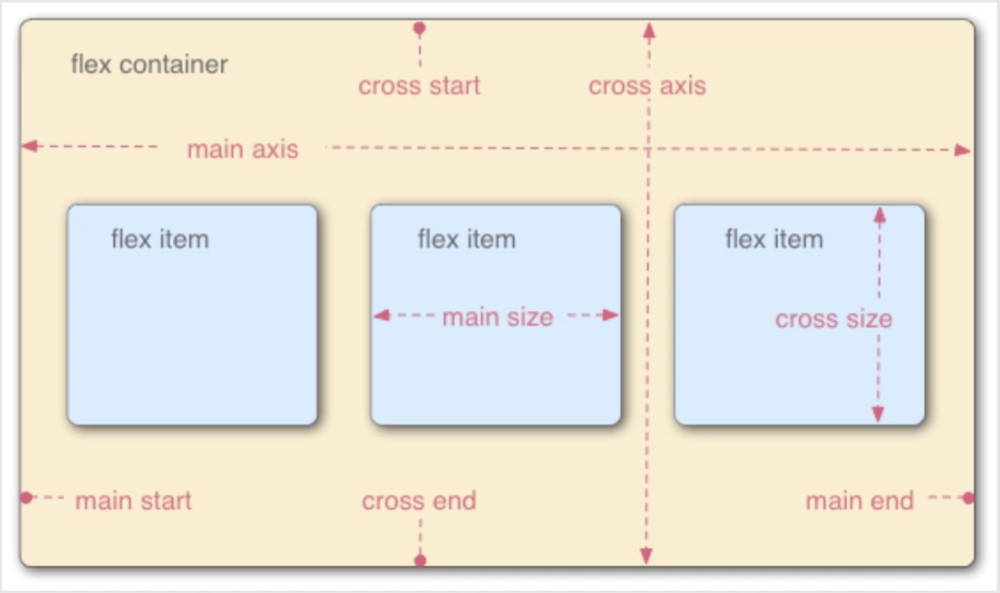

# 前端布局


## 移动Web布局

### Flex 布局

Flexible box 布局又称弹性布局 

1. ``flex 容器``

   ```css
   .box{
     display:flex | inline-flex;
     display: -webkit-flex;
     display: -moz-flex;
     display: -ms-flex;
     display: -o-flex;
     display:flex;
   }
   ```

2. ``flex``布局的示例图

   

   本图说明，在flex容器中包含``main axis``和``cross axis``主轴和交叉轴，默认情况下，主轴是水平的。

   flex中的项目默认会在主轴方向上排列

3. ``flex``容器的属性

   - ``display``属性：值包括 flex 和 inline-flex。包含了该属性的容器，才是flex容器

     flex值是有固定宽度的，inline-flex值是没有固定宽度的，它的宽度是由其内部元素撑开的。 

   - ``flex-direction``属性：值包括row ， row-reverse , column , column-reverse

     决定主轴的方向，如上面布局图所示。 row为默认值

   - ``flex-wrap``属性：默认情况下，所有item都排列在主轴上，该属性决定若轴排不下，多余的元素该如何处理。

     值包括，nowrap不换行,  wrap换行,  wrap-reverse反向换行 。默认情况下是nowrap， 即不换行，即再多的元素也被压缩到同一行。

   - ``flex-flow``属性：是flex-direction和flex-wrap两个属性的简写形式，默认值为 row nowrap；

   - ``justify-content``属性：定义了items在主轴方向上的对齐方式。值包括：flex-start左对齐、flex-end右对齐、center中央对齐、space-between两端对齐、space-around间隔相等对其。默认为flex-start。

   - ``align-items``属性：规定在交叉轴上的对齐方式，值为: flex-start上对齐、flex-end下对齐、center中央对齐、baseline基线对齐、stretch自适应，将item扩展到整个容器的高度。stretch为默认值

   - ``align-content``属性，定义了多根轴线的垂直对齐方式

4. ``items``的属性

   - ``order``，表示item在轴上的排列顺序，数值越小，越靠前。``order:0``
   - ``flex-grow``，表示项目放大比例，默认为0，即有item放大空间也不放大。数值若为1，则他们等分剩余空间。数值表示他们占容器的比例，如果1，2，3，1 则第二个容器占2/7
   - ``flex-shrink``，同理，该属性定义item缩小的比例大小，默认为1，即项目空间不够默认缩小。若为0，表示即使空间不足也不会缩小
   - ``flex-basis``，类似于固定宽度
   - ``flex``，是前三个flex-grow , flex-shrink, flex-basis的简写形式
   - `align-self`，允许某个item拥有自己特有的对齐属性，使其独立于其父容器的align-items


### 响应式布局

2010年Ethan Marcotte提出的，用于解决移动设备布局问题


## 通用CSS网页布局

 ### 行布局

1. 行布局让``div水平居中``

   css

   ```css
   .container{
     width:1000px;
     height:2000px;
   }
   .content{
     width:300px;
     height:300px;
     margin:0 auto;     /* 设置外边距上下为0，左右auto，则左右margin自动占满上一级div的大小，因而就会
     					挤的content水平居中；垂直居中同理 */
   }
   ```

   html 

   ```html
   <div class="container">
     <div class="content">  
       <!-- container容器中有个，content容器，现在要让content容器在container容器中居中显示-->
     </div>
   </div>
   ```

2. 让``div宽度随浏览器宽度变化``

   html

   ```html
   <body>
     <div class="content">
       <!-- 浏览器宽度大小自动改变body的宽度。-->
     </div>
   </body>
   ```

   css 

   ```css
   .content{
     width:80%;   /* 让 div 的宽度为浏览器宽度的80%，这样浏览器大小变动，该div的大小也就变动 */
     margin:0 auto;   /* 让该 div 水平居中，即始终处在浏览器中央 */
     max-width:1000px;   /* 让 div 有个像素的限制，即无论用户调节浏览器大小，当没有超过该像素限制时，div随浏览器
     							大小变动而变动；但是超过该限制，浏览器大小的变动将不会影响 div 的大小 */
   }
   ```

3. 常用的让div``垂直、水平同时居中``

   html 

   ```html
   <body>
     <div class="content">
       
     </div>
   </body>
   ```

   css 

   ```css
   .content{
     width:300px;
     height:120px;  /* 类似于百度首页搜索条，先设定好大小 */
     position: absolute;    /* 设置绝对相对位置 */
     top:50%;
     left:50%;     /* 设置绝对相对位置后，在设置相对于父元素的偏移，偏移50%， 这样content的左上角点，就会居中 */
     margin-top: -60px;
     margin-left:-150px; /* 在对外边距进行设置，使得该div 能够在向上和向左移动半个元素大小的位置，这样就居中了 */
   }
   ```

4. 经典行布局

   

   即，页面的组成，是一各个主行块组成。

### 多列布局

#### 两列布局

1. 效果图如下

   


#### 三列布局

1. 布局如下

   


### 圣杯布局

1. 布局如下

   

2. 要求中间栏在浏览器中优先展示渲染

3. 允许任意列的高度最高

   ```html
   <div class="container" >
     <div class="middle" >  中间  </div> <!--优先显示中间,所以先定义 -->
     <div class="left"> 左侧</div>
     <div class="right">右侧</div>
   </div>
   ```

   ```css
   body{
     min-width:700px
   }
   .container{
     padding:0 220px 0 220px;   /* 圣杯布局的关键，让中间容器左右缩进 */
   }
   .left , .middle , .right{   /* 圣杯布局的核心*/
     position:relative;
     float:left;
     min-height:300px;
   }
   .middle{
     width:100%   /*中间容器左右100%显示缩进后的contaienr*/
   }
   .left{
     width:200px;  
     margin-left:-100%;
     left:-200px;
   }
   .right{
      width:200px;
     margin-left:-220px;
     right:-220px;
   }
   ```

   

### 双飞翼布局

1. 双飞翼布局去掉了相对布局，只需要浮动和负边距
2. 双飞翼和圣杯布局最重要的就是``margin-left:-100%``，margin为负数时，使得整体``float``的块元素上移

