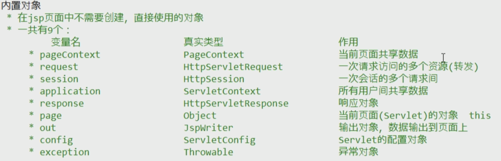

# JSP

## 概念

JSP ， ``Java Server Pages`` ，java服务器端页面。通俗的理解，一个种格式的页面，既可以定义``html``页面，也可以书写``java代码``。

JSP可以简化书写代码。


## JSP原理

JSP原理可以通过以下流程来反映：

1. 客户端访问某个``.jsp``文件
2. 服务器收到请求，检索路径是否有某个``.jsp``文件
3. 若存在，服务器就会对``.jsp``进行编译，生成某个``.class``字节码文件。这些字节码文件一般会被放到``work``文件夹下（临时文件文件夹）
4. 服务器调用该字节码文件，向用户返回响应文件。
5. 浏览器解析响应文件（html文件）并解析为页面展示。
6. 生成的``.class``字节码文件，就是``servlet``。其实现了service抽象方法


## JSP脚本

1. ``<%    java代码    %>``，这种方式定义的代码，会出现在servlet 的 ``service``方法中。

2. ``<%!   java代码    %>``，这种方法定义的代码，出现在servlet类中，也就是``成员变量``。不推荐，因为servlet最好不要添加成员变量。以防多线程并发访问servlet是，出现数据读写异常

3. ``<%=   java代码    %>``，这种方法定义的代码，会被``输出到页面``

4. ``<%@ 指令名称 属性名1=属性值1 属性名2=属性值2 %>``，用于配置jsp页面，导入资源 

    三种指令：

    - page，配置jsp页面属性

        ```jsp
        <%@ page contentType="text/html;charset=utf-8" pageEnconding="utf-8" language="java" buffer="8kb" %>  
        <%@ import="java.util.xxx....." %>
        contentType 表示页面内容miniType（响应头）
        pageEnconding 表示本页面编码
        buffer out对象的缓冲区大小
        import 导java包
        errorPage 发生异常后会跳转的页面
        isErrorPage 标识当前页面是否为Errorpage
        ```

    - include，导入**页面**资源文件。包含其他jsp页面

        ```jsp
        <%@ include file="top.jsp" %>
        <% ...... %>
        <%@ include file="base.jsp" %>
        ```

    - taglib ，导入资源，导入标签库。这样在jsp中就可以使用非html、非jsp的标签

        ```jsp
        <%@ taglib prefix="mytag" uri="http://java.sun.com/jsp/jstl/core" %>
        使用标签
        <mytag:xx......></mytag:xx......>
        ```

5. ``<%--  --%>``注释

## JSP 内置对象

JSP 有9个内置对象

1. ``Request`` 和``response``，由于jsp编译后就是servlet，所以这两个对象默认存在，可以直接调用。
2. ``out``对象，内置的jsp，类似于``response.getWriter()``对象。可以直接使用
    - ``response.getWriter()``与``out.write()``区别：tomcat服务器在给客户端响应之前，会先找response的输出缓冲区，再找out缓冲区数据。因而会使得response输出的内容，永远先于out输处。  所以建议，永远用out对象，不要用response.getWriter对象
3. session，HttpSession对象
4. application，实际上就是servletContext对象
5. page，当前的servlet对象
6. pageContext，实际是pageContext对象。``通过该对象可以获取其他所有的8个对象``
7. config  ServletConfig对象 
8. exception，声明了isErrorPage="true"的jsp页面，才能使用该对象




## EL表达式

### 概念

### EL = ``Expression Language``

### 作用 

他可以替换和简化，JSP页面中Java代码的编写。

JSP默认就``支持EL``表达式的，但如果有页面配置，则忽略页面所有EL

```jsp
<%@ page isELIgnored="true" %> 忽略EL表达式
```

### 语法

``${ 表达式 }``

``\${ 表示式 }``，主动忽略转义表达式，这样表达式就按字符串原样输出

### 案例

- 运算

```jsp
${ 3 > 4 }  页面输出false
${ 3+5 > 33 || true }
${ empty list}  判断元素是否为null，list，map内容长度是否为0。
${ not empty list} 判断是否不为null或长度为0
```

- 获取值

    EL表达式，只能从``域对象``中提取值

    ```jsp
    ${域名称.键名}  // 从指定域中，获取指定值
    ${requestScope.getAttribute("name")}
    ```

    域的范围

    |    域名称    |   所指域对象   |    作用范围    |
    | :----------: | :------------: | :------------: |
    |  pageScope   |  pageContext   |    当前页面    |
    | requestScope |    request     |     转发链     |
    | SessionScope |    session     | 会话的多次交互 |
    | application  | servletContext |      全局      |

    域名在EL中是可以忽略的。若忽略，EL表达式在寻找属性时，根据域的大小，从小到大查找里面是否含有某个属性

- 获取对象属性

    ```jsp
    <%
    	User user = new User();
    	user.setName("zhangsan");
    	user.setAge(15);
    	request.setAttribute("u",user);
    %>
    
    使用方式  ${域名.键名.属性名}
    ${requestScope.u.name}      requestScope拿到request对象 .u获取属性中key为u的对象 .name调用属性方法getName
                                所以一定要有javaBean打包，这样才能有getName方法
    							即使没有JavaBean打包。只要有getXxx()方法，依然能调用 u.Xxx
    ```

- 获取list和mapt对象

    ```jsp
    <%
    	List<String> list = new ArrayList<String>();
    	list.add("hello");
    	list.add("world");
    	request.setAttribute("list", list);
    
    	Map<String, String> map = new HashMap<String, String>();
    	map.put("name", "张三");
    	map.put("age","15");
    	request.setAttribute("map", map);
    %>
    
    list 使用方式 ${域名.键名[index]}
    ${requestScope.list[0]}   打印hello
    
    map 使用方式 ${域名.键名.key}
    ${map.name} 
    或者
    ${map["name"]}
    ```

    

### EL 隐式对象

EL中的8个隐式对象，默认被创建好，可以直接使用

1. pageContext

    ```jsp
    ${pageContext.request.contextPath}   // 获取虚拟路径
    ```

    


## JSTL

### 概念

JSTL表示 ``JavaServer Pages Tag Library`` JSP标准标签库


### 作用

用于简化和替换JSP上的Java代码。这样可以实现前端和后端分离。前端人员不用关心、懂得Java代码，只使用相关标签就可以


### 使用步骤

1. 导入``jstl``jar包
2. Jsp中引入标签 ``<%@ taglib prefix="xx" uri="." %>``
3. JSP使用标签


### 常用标签

1. ``if``：相当于if语句

    ```jsp
    <%@ taglib prefix="c" uri="http://java.sun.com/jsp/jstl/core" %>
    
    ----------
    使用标签，if标签必须接传递一个test属性。如果为真，显示表达式，如果为false不显示。一般会结合EL表达式使用。
    <c:if test="5>3">
    	5 确实大于 3
    </c:if>
    -------------------------------------
    ```

    使用案例：

    ```jsp
    <%@ taglib prefix="c" uri="http://java.sun.com/jsp/jstl/core" %>
    
    <% 
    	List list = new ArrayList();
    	list.add("aaa");
    	request.setAttribute("list", list);  // 将list放到request域对象中
    %>
    
    <c:if test="${not empty list}">   <%-- 判断集合是否不为空  --%>
        <p>
            ${list[0]};
        </p>
    </c:if>
    ```

    

2. ``choose``：   相当于java中的switch语句

    案例：

    ```jsp
    <%@ taglib prefix="c" uri="http://java.sun.com/jsp/jstl/core" %>
    <%
    	request.setAttribue("number", 3);
    %>
    <c:choose>
        <c:when test="${number==1}">星期一</c:when>
        <c:when test="${number==2}">星期二</c:when>
        <c:when test="${number==3}">星期三</c:when>
        <c:when test="${number==4}">星期四</c:when>
        <c:when test="${number==5}">星期五</c:when>
        <c:when test="${number==6}">星期六</c:when>
        <c:when test="${number==7}">星期日</c:when>
        <c:otherwise>数字输入有误</c:otherwise>
    </c:choose>
    ```

    

3. ``foreach``： 相当于for循环

    ```jsp
    <c:foreach begin="1" end="10" var="i" step="1">  <!-- 包括10 -->
    	<h5>
            ${i}  <!-- 打印 i 变量 -->
        </h5>
    </c:foreach>
    
    <c:foreach var="temp" items="${list}">   类似于  for(String temp: list)
    	${temp}  
    </c:foreach>
    ```

    


