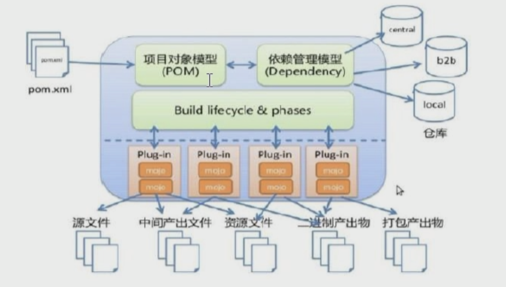

# Maven

Maven是对Java工程的管理打包系统。

## 功能

1. 依赖管理
2. 一键构建


## 依赖管理

一个电脑中，可能有多个工程在运作或处在开发阶段。这样就需要对每个工程中使用的包进行加载。

**传统上，一个Web工程，都有自己的目录结构，保存所依赖的Jar包**。这样在有多个工程的开发环境，就需要存储多份相同的Jar包。

**由Maven管理的Jar包，实际的Jar包存储在一个``Jar仓库``之中**，每个工程在使用时，只存储一个指向Jar仓库的映射连接。因而大大减少了空间的重复占用 


### 仓库位置。

Maven所构建的工程中，Jar包实际是一个指向Maven包仓库的地址。实际包存在maven仓库中

Maven仓库的位置由 ``conf/settings.xml``中的:

1.  localRepository 配置。默认在``~/.m2/repository``下。该仓库表示本机在的Maven仓库路径
2. 若本机能联网，则Maven工具还会去 ``互联网上中央仓库``去寻找Jar包
3. 为了方便开发，公司都将``互联网中央仓库``中的某些Jar包，下载到``远程仓库``中做备份。然后将Maven仓库包查找索引指向该 ``远程仓库``。即从本地Maven仓库寻找不到Jar包，先到``远程仓库``查找。然后再到中央仓库查找。
4. ``远程仓库``，远程仓库又称为私服。表示里面的包，或者从互联网上下载到局域网服务，或者从本机上传。


### 依赖包冲突问题

在书写依赖时，在Pom.xml中配置了相关的``dependency``。Maven会自动将该包系列导入。

但有时候会出现导入依赖包冲突的问题。

```xml
   <dependencies>
    <dependency>
      <groupId>junit</groupId>    
      <artifactId>junit</artifactId>
      <version>4.11</version>
      
      <scope>test</scope>     <!-- scope 域，表示该包可用于 Maven声明周期的 test  -->
      
        
      <exclusions>    <!-- 排除传递依赖中的某个包  -->
          <exclusion>
              	<groupId>junit</groupId>    
      			<artifactId>junit</artifactId>
      			<version>4.11</version>
          </exclusion>
      </exclusions>
   
      
      </dependency>
  </dependencies>
```

解决包依赖冲突的方法：

1. 第一声明，表示如果遇见冲突，优先导入``POM.xml``，靠上位置的依赖。即写在上面的优先级高

2. 直接依赖优先级大于传递依赖

    - 直接依赖：项目中直接导入的依赖包，即由dependency直接写入的依赖包

    - 传递依赖：直接依赖的jar包所需要的依赖包

3. 用``<exclusions></exclusions>``标签，来排除某种版本的传递依赖。 **推荐**


## 一键构建和生命周期

传统的Web工程构建方式为

>  Maven 构建的生命周期
>
> 1. 编译                   				生命周期1，对应命令compile
> 2. 测试                                  生命周期2，对应命令 test
> 3. 打包                                  生命周期3，对应命令 package
> 4. 上传服务器，并安装      生命周期4，对应命令 install
> 5. 部署，运行                      生命周期5，对应命令 deploy

这每一步都需要认为的设置与操作。

``Maven``一键构建，可以帮助我们根据配置文件，一键完成上述操作。 该配置文件为``pom.xml``。其中包含Jar包的映射地址


## Maven工具的目录结构

1. 首先解压安装Maven下载安装包

    - 目录结构：
        - bin：Maven工具命令目录。
        - boot：Maven运行的类加载器
        - conf：settings.xml是Maven配置文件
        - libs：Maven自身运行所以来的依赖包

2. 配置环境变量

    ``MAVEN_HOME`` = 主目录，

     ``Path``中配置MAVEN_HOME/bin。将maven命令添加进指令路径

3. 运行``mvn -v ``命令，成功显示，表示安装成功

    


## Maven项目的目录结构

Maven项目目录结构

```
Maven项目名
	src
		main			代码主目录
			java 		核心代码目录
			resources 	核心代码配置目录
			webapp		如果是web工程，还会有本目录，里面放置的都是web页面资源
				js
				css
				img
		test			测试主目录
			java		测试核心代码目录
			resources	测试资源配置目录
		
		
```


## Maven 命令

1. ``Mvn clean``，清除本工程下的原始生成代码，用于重新生成干净的Maven工程环境。该命令会清除目录下的``target``目录
2. ``mvn compile``，编译工程项目，会在本目录下生成``target``目录。该编译只是编译``src/main``下面的代码
3. ``mvn test``，编译test目录下的代码， 并运行测试。该方法也会在target目录下生成相关的目录结构。若没有编译main中的主代码，该命令还会编译src/main下的代码
4.  ``mvn package``，将test，main中的代码进行编译，然后并打包成war包存于target目录之下
5. ``mvn install`` ，该命令不仅执行了``mvn package``命令的所有操作，他还将该包安装到了 ``maven 本地仓库`` 
6. ``mvn deploy``，部署。将打包并安装的maven工程进行部署。部署之前需要对maven进行配置。而且他还会将打包好的包上传至``私服``


## Maven 项目配置

Maven结构图如下



### 项目配置模型

醒目配置模型，即对maven要构建的项目进行配置，也就是对``pom.xml``文件进行设置。POM表示 ``Project Object Model``项目对象模型

该配置文件中包含三个大的部分：

1. 项目自身信息(POM模型)
2. 项目所依赖的Jar包的信息（依赖管理模型）
3. 项目所用到的插件信息，包括JDK，Tomcat服务器配置，JDBC连接配置等。甚至maven命令，包括compile、test、install等都需要这些底层插件


## Maven Management

在``POM.xml``中，所有带Management结尾的标签，都是用来锁定版本的。它不实际导入包或插件。

该方式，是Jar包的``锁定``。

**注意：该management标签只负责锁定，不负责真正的导入jar包**


举个简单的例子

>项目A开发用到了Spring 5 框架。生成了一个工程。放到repo中，供以后的项目使用。
>
>项目B中的部分功能使用了A项目。但是开发B项目的人员却习惯性使用Spring 4。
>
>B项目中直接dependency导入的是直接依赖
>
>由A项目继承下来的Jar包dependency导入是间接依赖。
>
>直接依赖 > 间接依赖
>
>因而造成 B项目中引用的 Spring 4 使得A项目出错。这样B项目就无法使用A项目了。
>
>结局方式就是对A项目中的dependency通过management进行锁定。例如锁定Spring 5。
>
>这样B项目在继承A项目之后，由于包锁定，它就必须使用Spring 5 包。


使用方式 

```xml
  

<dependencies>  <!--依赖选项 -->
    <dependency>
      <groupId>junit</groupId>
      <artifactId>junit</artifactId>
      <version>4.11</version>
      <scope>test</scope>
    </dependency>
  </dependencies>

<dependencyManagement> <!-- 只要添加一个外层 dependencyManagement，并使用变量代替版本就可以，这样就锁定了该版本-->
      <dependencies>
        <dependency>
          <groupId>junit</groupId>
          <artifactId>junit</artifactId>
          <version>${junit.version}</version>   <!-- 在POM.xml中使用 EL 表达式。要使用EL，前面必须有配置-->
          <scope>test</scope>
        </dependency>
      </dependencies>
 </dependencyManagement>

<!-- 统一管理Jar的版本号 -->
<properties>     <!-- 要使用 EL表达式， XML中的属性（版本号）配置 -->
    <spring.version>5.0.2</spring.version>
    <junit.version>4.11</junit.version>
</properties>
```

