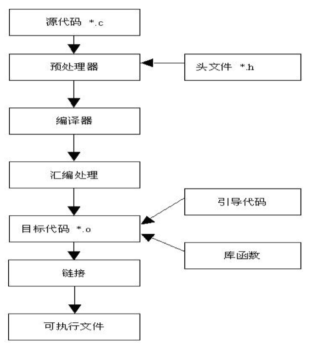

# gcc简单使用

### C或C++程序的编译执行过程

<div align="middle">



</div>

**编译工具链** = 预处理器+编译器+汇编工具

#### 正常编译流程

1. 预处理

   ```bash
   gcc -E main.c -o test.i
   # gcc -E 参数，即执行预处理操作
   # 结果一般保存为.i后缀的文件
   # -o 参数，为对输出命名
   # 执行结果 main.c 中的 define，include 等预操作都被替换
   ```

   ```c
   #define debug  //调试开关
   int main(){
   #ifdef
       printf("lalala");
   #endif
       return 0;
   }
   // 此处执行了预编译后，若ifdef成立，则printf()代码会出现在.i文件中
   ```

   - 预编译替换```define```，不替换```typedef```。
   - \#ifdef，#ifndef，#endif

2. 编译

   - 编译成汇编源文件

     ```bash
     gcc -S main.i -o main.s
     # gcc 通过编译预处理后的文件生成.s文件
     # .s文件是汇编源码文件，是文本文件，里面包含许多汇编指令。
     ```

     

   - 汇编成目标文件

     ```bash
     as main.s -o main.o
     # 用as命令将汇编文件生成二进制目标文件，
     # 目标文件中留有链接库的地址
     # 目标文件无法用vim等文本解析器查看
     # 查看目标文件需要用nm命令
     nm main.o
     # 该函数可以查看目标函数的链接
     ```

3. 链接

   ```bash
   gcc main.o -o main
   # gcc 链接main.o和库从而生成main 可执行程序
   ```

   

### gcc编译

-  -c 参数，只编译，不链接，即生成.o

- -E 参数，生成预编译文件.i

- -S 参数，编译成汇编源文件.s

- -I dir 参数，在编译时添加头文件搜索路径dir

- ```bash
  gcc main.c -I ./myheaders
  # 添加myheaders为头文件搜索路径
  ```

  ```c
  // myheaders下有头文件header.h
  #include "header.h"
  ```

- -D <宏命令>

  ```bash
  gcc main.c -I ./myheaders -D DEBUG
  # 将DEBUG 作为#define 的内容传入到编译过程中
  # 该方式可以结合debug开关，用于调试。
  # 这样在编译时就不用对代码直接更改，从而实现动态编译。
  ```

  

- -Wall 打开最高级别的警告

  - 警告级别用于不同编译等级需求

### Linux 库

- 动态库：

  - libname.so[主版本号，次版本号，发行号]，lib开头，name表示库名，.so为后缀

  - 动态库不会在编译时候加载到目标代码中，而是在执行的时候加载到内存地址空间的代码段

  - 创建动态库

    ```c
    // add.c 源文件名
    // 将一个简单的求和函数编译成动态库
    int add(int a, int b){
        return a+b;
    }
    ```

    ```bash
    gcc -fPIC -Wall -c add.c 
    # 该代码生成了add.o
    # -fPIC 生成程序相对地址无关代码
    # -Wall 打开所有警告，确保编译动态库时没有任何级别的警告，以防别人调用时出现库内警告
    # -c 创建新的目标文件.o
    gcc -shared add.o -o libadd.so
    # 该代码生成了libadd.so动态库
    # -shared 是生成动态库的命令，使用经过相对地址无关化后的目标文件
    ```

    　在编译好libadd.so后，将动态库放入，```/usr/lib```或```/lib```或```/usr/local/lib```下即可。

    ```c
    // main.c
    #include <stdio.h>
    int main(){
        printf("%d",add(3,4));
    }
    ```

    ```bash
    gcc main.c -ladd
    # 编译程序留有动态链接库add的接口
    # 当执行时可执行程序就会自动加载add.so库
    # add 表示需要加载的库的名称
    ```

    

- 静态库

  - libname.a，lib开头，name表示库名，.a为后缀
  - 静态库会在链接时将静态库代码添加到可执行程序当中


