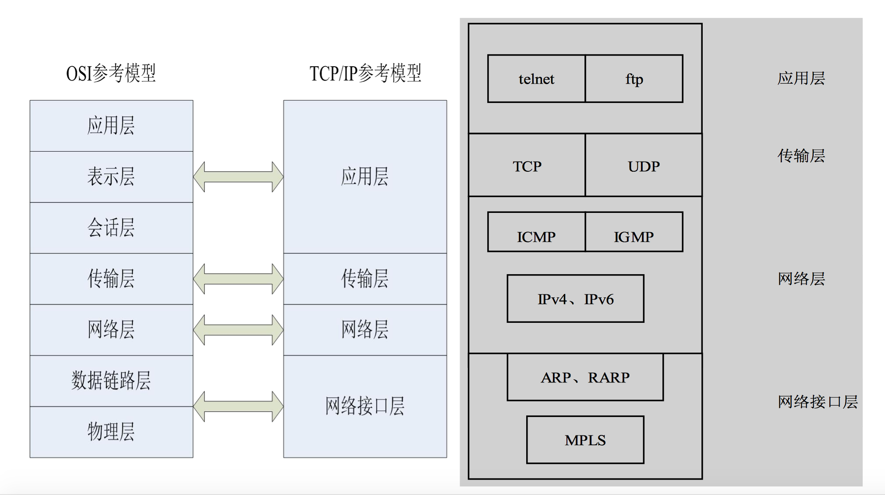
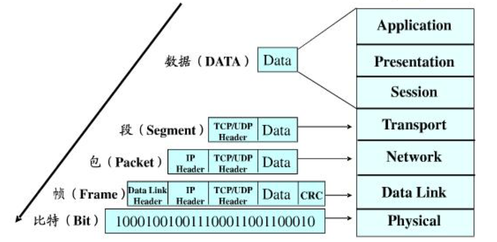
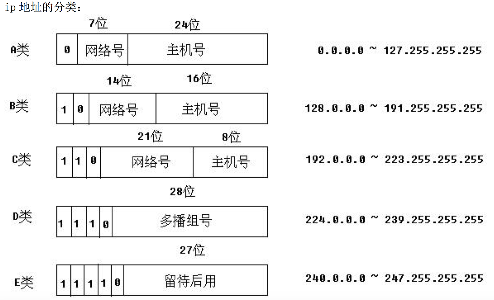
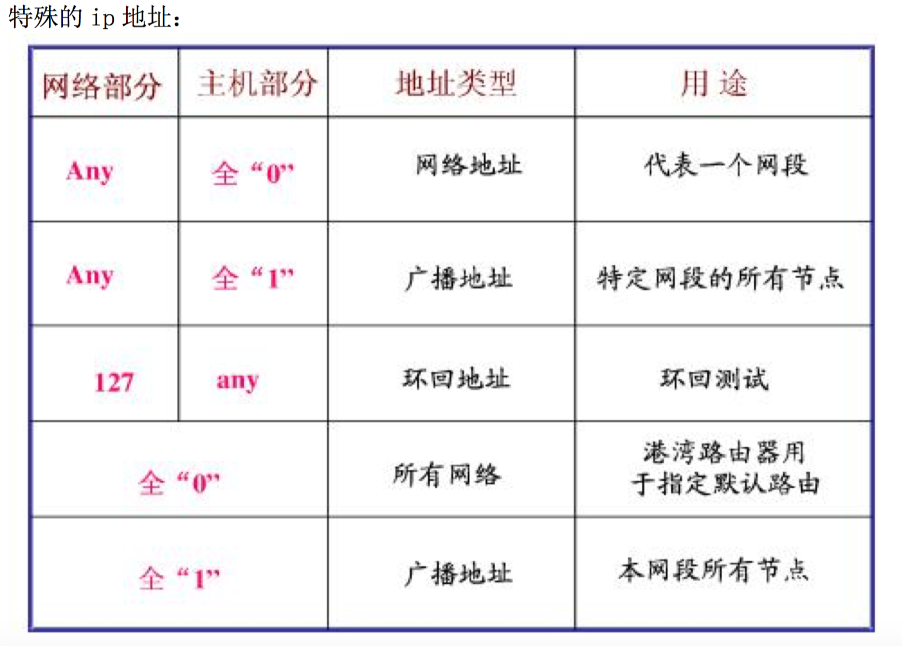

# Linux 网络

### 网络通信的协议栈

<div align="center">
    
    
</div>

### 网络IP地址分配
<div align="center">
    
    
</div>


### 网络字节序

#### 字节序由来

由于Intel和AMD的计算机体系结构都属于```x86```架构。而```x86```架构的计算机存储数据是以**小端模式**进行，而IBM等架构采用**大端模式**。

即，数据的字节被存储的地址顺序，如下：

内存地址			01 02 03 04 （地址从小到大）

真实数字  	0x	12 34 56 78 （4字节）

x86架构存储	0x	78 56 34 12

IBM架构		0x	12 34 56 78

由于当今```x86```是计算机主流架构，因而多数计算机都是用的小端存储模式。

***但是，网络通讯的字节序却是大端模式***

因而在网络通讯之前，接收方和发送方都需要进行数据字节序的转换，即

发送方（无论什么架构）需要用hton函数转化成网络字序

接收方（无论生么架构）需要用ntoh函数转换成主机字序

#### 字节序转换函数

```c
#include <arpa/inet.h>

uint32_t htonl(uint32_t hostlong);
// h代表host主机的意思, to, n代表network网路的意思
// l或s分别代表转化的是long型还是short型数据

uint16_t htons(uint16_t hostshort);

uint32_t ntohl(uint32_t netlong);

uint16_t ntohs(uint16_t netshort);
// 这四个函数就可以把主机数据转化成网络字节序
```

上面四个函数是用来对转化数据字节序的。

**该函数会判断本主机架构**，即如果IBM（本身为大端）他在接收网络上的数据（大端序）后，执行``ntohl或ntohs``，实际的字序不会发生改变，因为传来的数据和本身的体系结构字序是一致的。