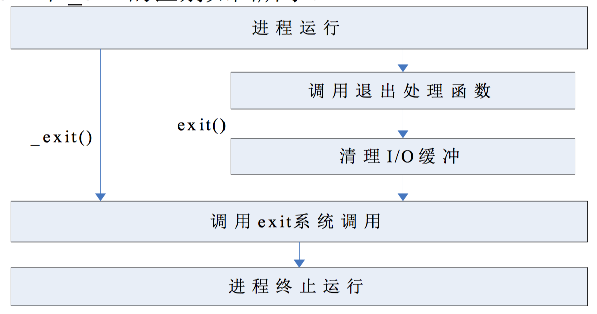

# 进程

### 进程的定义

进程是一个执行着的程序，进程的主要标志为```PCB```，即进程控制块。

PCB记录着所有程序执行着的信息，包括地址，资源，控制信息。

进程是资源、调度的分配和执行单位。

### 进程的启动链

每一个进程都有```pid```即进程编号，以及```ppid```进程的父母id编号。

一个进程永远是由ppid所对应的进程拉起来的。

1. Linux系统启动时，首先由boot固件通电。有烧刻在boot的上的bootloader引导程序将磁盘中的操作系统引导程序强制加载到物理内存固定的区域，并且设置```PC```指针指向该区域。
2. CPU逐条执行内存中的该引导程序，具体过程就是将操作系统启动的文件逐一加载到内存并解压。
3. 该过程由/sbin/init程序执行，pid为0，没有ppid。
4. /sbin/init程序执行一些最基本的操作系统初始化，然后将其自身pid改成1，然后启动第二个进程```kthreadd ```，其pid为2。
5. 所有其他的进程皆有该进程逐一拉起。
6. 其中最终要的进程为```用户终端登录进程```，以及由该进程拉起来的```bash```进程。

### 调度策略

- 实时调度策略：FIFO，RR（轮转调度策略：根据等级进行调度，同等级的用FIFO）

### 进程用法

#### 进程命令

- ```ps```命令，即报告当前进程状态的命令，时间切片观察，即两次采样，然后观察这段时间内进程的状态，例如是否执行过，执行过则状态为R。常用命令参数如下：
  - ```ps -elf```，静态显示进程的某一个时间节点状态，显示结果如下：
    1. F
    2. S：进程状态，包括R 运行，S 睡眠，T 暂停(进程运行时按ctrl+z)，Z 僵尸（进程异常结束，资源却没有被回收，即PCB结构体依然存在）
    3. UID：进程UID，进程的调用者名
    4. PID：进程ID
    5. PPID：进程父ID
    6. C
    7. PRI：进程优先级，默认为80，范围-40～99，值越低，优先级越高
    8. NI：手动更改的优先级
    9. ADDR
    10. SZ
    11. WCHAN
    12. STIME
    13. TTY
    14. TIME：进程累计运行时间，即R运行时间，不是启动至今的时间
    15. CMD：进程调用的命令
  - ```ps -aux```，查看进程资源占用情况
    1. USER
    2. PID
    3. %CPU
    4. %MEM
    5. VSZ
    6. RSS
    7. TTY
    8. STAT
- ```top```命令，动态观察进程情况
  - top 命令观察时，有一个%CPU(s): 50.2 us , 0.4 sy，47.2 id。其中us表示用户态占用，sy表示内核态占用，id表示空闲。
- ```free```命令，用来查看系统当前内存情况
- ```who``` 命令可以查看系统当前登录的```用户进程端口```
  - 每登录一个用户，系统就会建立一个对应的端口。并且在设备目录下```/dev```下建立相应的虚拟块设备，与其对应，一般为```tty#```。
- ```nice 和 renice```修改进程优先级命令
- ```kill```信号命令，-l可以查看具体参数，主要作用就是通过系统中断，提供相应的信号
- ```crontab```设置定时任务，可以通过查看```/etc/crontab```文件来修改
- ```jobs```查看用户开启进程执行状态
- ```bg # ```，将序号进程重新加载到后台运行
- ```fg #```，将序号进程重新放回前台运行

#### 进程函数

- getpid/getppid，获取当前进程的id和父id

- ```c
  #include <sys/types.h>
  #include <unistd.h>
  
  pid_t getpid(void);
  pid_t getppid(void);
  // pid_t 即为int类型进程编号
  ```

- getuid/getgid，获取当前进程的**真实用户id和用户组id**

  ```c
  #include <unistd.h>
  #include <sys/types.h>
  uid_t getuid(void); // 获取真实用户id
  gid_t getgid(void); // 获取真实组id
  ```

  真实用户id和组id标示创建该进程的**用户id**和**用户组id**，是唯一不可更改的，即哪个用户创建了该进程。

- geteuid/getegid，获取当前进程的**有效用户id和有效组id**

- ```c
  #include <unistd.h>
  #include <sys/types.h>
  uid_t geteuid(void); // 获取有效用户id
  gid_t getegid(void); // 获取有效组id
  ```

  有效用户id的作用如下例子描述：

  - ```/etc/shadow```文件的权限```-rw-r----- 1 root shadow ```，即文件写权限只能由root进行
  - 但是我们一个```普通用户```可以通过```passwd命令```，对自己的密码进行修改，```passwd命令```中包含了对```/etc/shadow```进行修改的逻辑
  - 用命令```which passwd```，来查看```passwd命令```的位置
  - 找到位置后用```ls -l /usr/bin/passwd```命令查看passwd命令的权限，发现```passwd 命令```权限为```-rwsr-xr-x 1 root root ```，即root用户的可执行权限为```s```，即只有root用户可以执行passwd命令从而操纵```/etc/shadow```的修改。
  - **可提升权限的文件一定是可执行文件**。如果对一个非可执行文件，即没有```x```权限的文件执行```chmod u+s file1```，则该文件的可执行权限会变成大```S```。大```S```代表该文件的权限错误。因而赋值小```s```权限，必须用```chmod u+x+s file1```命令。
  - 在文件类别字段，即 ```0000   000  000000000```中，前4位标示文件类型，后9位标识u，g，o权限，中间3位中的一位就表识小```s```位。
  - ```s```权限代表**可提升权限，**即在其他用户执行该文件时，临时将该用户提升到创建该文件用户的执行权限。
  - 具体来讲就是，当用户```test```执行```/usr/bin/passwd```（可执行文件，拥有用户s权限）命令时，临时将```test```的```euid```提升到root级别（其他用户创建的s权限，就提升到其他用户级别，本例中是root级别）。然后Linux操作系统判断执行该命令进程的```euid```时，发现其同命令文件```/usr/bin/passwd```的用户id相同（即root），则该进程就不会被阻挡，因而可以继续进行，从而通过命令修改了```/etc/shadow```文件。
  - 操作系统具体判断进程执行权限时，主要是参考进程的**有效**```euid```和```egid```。而进程的```uid```和```gid```只是标示进程的归属。

- getpgid，获取进程组id

- ```c
  #include <unistd.h>
  int setpgid(pid_t pid, pid_t pgid); // 设置进程组id，可以是创建一个新的进程组
  pid_t getpgid(pid_t pid);	// 返回进程组id
  ```

- getsid，获取会话id

- ```c
  #include <unistd.h>
  pid_t setsid(void);		// 设置一个会话组id
  pid_t getsid(pid_t pid); // 获得一个进程的会话组id
  ```

#### fork 函数

创建进程函数，是系统调用。fork函数的执行流程如下：

  1. 父进程当执行到fork系统调用时，完美的拷贝自己的PCB，由于PCB由多层嵌套结构，因而拷贝费时。
  2. 拷贝完毕后，给新的PCB设置一个新的pid，默认为父进程pid + 1（如果进程号没有被占用）
  3. 拷贝完毕后，父进程将拷贝好的新子进程PCB投放到就绪队列之中，就从fork函数调用接口返回。
  4. 新的子进程PCB在就绪队列中等待，等待下一个CPU调度周期的到来。然后CPU调度子进程执行。由于子进程拷贝的父进程的PCB，同时也包括父进程返回函数的接口地址，即fork出口地址。因而，子进程在等待到下一个调度周期后会通过fork返回。
  5. 正是由于第四步，fork系统调用返回两次值，且父进程先返回，子进程后返回。
  6. 同时由于子进程的PCB时父进程PCB的完美拷贝，使用 fork 函数得到的子进程是父进程的一个复制品，它从父进程继 承了进程的地址空间，包括进程上下文、进程堆栈、内存信息、打开的文件描述符、信号控制设定、进程优先级、进程组号、当前工作目录、根目录、资源限制、控制终端，而子进程所独有的只有它的进程号、资源使用和计时器等。通过这种复制方式创建出子进程后，原有进程和子进程都从函数 fork 返回， 各自继续往下运行，但是原进程的 fork 返回值与子进程的 fork 返回值不同，在原进程中，fork 返回子进程的pid,而在子进程中，fork返回0，如果 fork返回负值，表示创建子进程失败。

  ```c
  #include<stdio.h>
  #include<unistd.h>
  int main(){
      pid_t pid;	//定义一个进程id变量
      pid = fork();	//执行fork系统调用
      // fork第一次返回，返回值为copy PCB后的子进程的进程id，返回后父进程继续执行
      // fork第二次返回，返回值为0，返回后进程跳入子进程。
      // 简单来说，如果父进程返回，则携带子进程的id返回
      // 子进程返回，则什么也不携带
      // 如下
      if(pid==0){
          // 子进程的代码
      }else{
          //父进程后续的代码
      }   
      // 公共执行的代码
  }
  ```

fork拷贝PCB后，对于资源的利用遵循：**写时复制**

***子进程拷贝父进程PCB，同时也拷贝了父进程定义的变量。因而子进程读相应的变量，返回的是父进程定义的内容。如果子进程改变了相应的变量内容，只有这时，系统会检查相应PCB，发现该变量不是由子进程定义的，因而只有此时，系统才会为子进程定义相应的变量。而父进程仍然是原来的变量***

```c
#include<stdio.h>
#include<stdlib.h>
#include<unistd.h>
#include<string.h>
int main(){
    pid_t pid;
    char * p = (char *)malloc(20);
    memset(p,0,20);
    strcpy(p,"Hello");
    pid = fork();
    if(pid==0){
        puts(p); // 第二步，此时返回的是父进程的p，即Hello
        strcpy(p,"lalala");	// 此时改变了p的内容，此时执行写时候复制
        				// 此时，系统真正为子进程开辟相对应的新p和新p所指向的新malloc空间
        puts(p); // 第三步，此时返回的则是新p和新malloc出来的空间中的内容，即lalala
    }else{
        puts(p); // 第一步，fork返回父进程，此时返回父进程的p，即Hello
        sleep(1); // 睡眠一秒，此时子进程fork返回，即第二步执行
        puts(p);  // 第四步，子程序执行了写复制并睡sleep(1)后，父进程继续执行。p仍返回Hello
        	     // 因为，经过写复制后，子进程才真正拥有自己的p和相应的malloc空间，从而和父进程分离。
    }
}
```

#### exec 函数簇

exec函数的作用是：替换掉进程代码段为指定程序的代码段。即从执行一个程序，变成执行另一个程序。

```c
#include <unistd.h>
int execl(const char *path, const char *arg, ... // path为新程序的路径，arg为执行参数
                       /* (char  *) NULL */);
int execlp(const char *file, const char *arg, ...
               /* (char  *) NULL */);//区别execl 此处的file为'add'而不用是'./add'
int execle(const char *path, const char *arg, ...
               /*, (char *) NULL, char * const envp[] */); // 多一个env变量
			// 即此处可以更改环境变量
int execv(const char *path, char *const argv[]);
int execvp(const char *file, char *const argv[]);
int execvpe(const char *file, char *const argv[],
// 使用
int main(){
    printf("I am main\n");
    execl("./add","add","2","4",NULL); // 将本程序替换成执行./add
    // 后面的add 2 4 为参数，最后NULL用于检测参数的列表的结束
}
```

***结合fork系统调用和exec簇系统调用，可以生成任意的进程；fork开辟新进程然后用exec替换该进程执行新的目标***

#### 孤儿进程和wait/waitpid系统调用

孤儿进程：当一个父进程先于子进程结束，子进程就变成孤儿进程。孤儿进程会被init（pid为1）的进程接管。若此时孤儿进程结束，其资源回收工作（即，销毁PCB工作）有init进程来帮助完成。因为init对资源的回收是定时的轮询，因而很容易造成将是进程大量存在的情况。从而影响系统效率

wait和waitpid函数：当子进程先于父进程结束，子父进程必须做对子进程进行资源回收的清理工作。回收方法就是调用wait系统调用。

***所有进程的资源回收工作都是由父进程进行，孤儿进程由其父进程init进行***

**wait 函数**：

```c
#include<stdio.h>
#include<unistd.h>
#include<wait.h>
  int main(){
      pid_t pid;	//定义一个进程id变量
      pid = fork();	//执行fork系统调用
     
      if(pid==0){
          // 子进程的代码
      }else{
          //父进程后续的代码
          wait(NULL); //父进程在此处等待子进程的结束，
          // 等待过程，父进程进入睡眠状态
          // 当子进程结束时，子进程向父进程发送信号，
          // 从而唤醒wait处。然后wait执行清理工作。
          // 清理结束后，父进程再继续执行之后的代码
          // 若没有wait，也就没人帮子进程进行清理，资源回收
          // 子进程就变成zombie进程。
          // wait(NULL) 只执行一次，即如果多个子进程同时结束
          // wait接收一个信号量就返回结束。因而若要回收所有
          // 子进程，则需要循环wait，n次。
          // wait()表示随机等待子进程，不指定特殊一个
          pid_t waitpid(pid_t pid, int *wstatus, int options);
          // 该函数可以指定等待那一个子进程结束
          // 参数wstatus，是一个传入传出参数，表示子进程的程序返回值，
          // 主要是main返回值，而不是一般函数的返回值
          // 即子进程个return值，可以用该传入传出参数携带出来。
          // 填写NULL，表示不需要返回值
      }   
  }
```

wait的参数：

- status：是个整型的传入传出参数，调用wait后会对该参数赋值，使其携带退出时信息（return或exit信息）。这些信息占status的其中几位，另外几位另有它用。对于检查该参数，有几个宏函数：
  - **WIFEXITED(**wstatus**)** ：子进程正常返回，则该函数返回true。此处正常的概念定义为，非程序定义的return或exit处终止。程序定义的return包括主动定义的exit函数，return 0，return -1（即使是错误返回，也是程序员指定好的一条路径，因而返回也是true），非定义返回则是指程序执行过程中出现的错误，例如解引用空指针，数组越界等
  - **WEXITSTATUS(**wstatus**)** ：当子进程正常返回，即上一步为true，则该函数返回程序携带出来的返回值，即return 值

waitpid的参数：

- status：同wait
- option：主要的是用**WNOHANG**，该参数值会在执行到该代码时检测指定id的子进程有没有退出（发送信号量），若有则回收其资源，完成清理工作。若没有直接跳过代码，继续执行后面代码，即**WNOHANG**参数会阻止父进程在执行wait时挂起sleep。**WNOHANG**是宏定义的一个整数。
- 返回值：成功回收指定进程则返回相应的pid。若是指定进程存在，但是其状态没有发生改变（R，T，S，Z），则返回0。若是错误，则返回-1

####进程终止

进程终止形式由5种

1. main函数自然返回，即return返回。但是其他定义的函数的return，则不预示着进程返回。因而在子程序，或是堆栈调用函数中，想让程序终止，则只能用exit函数。**因而，return的作用单是返回并退出本函数**，由于main是程序开始执行的第一个函数，即函数栈最底层函数，因而main返回，就意味着程序终止。

2. exit函数

3. _exit函数

   exit函数是对_exit函数调用的封装，因为标准库对所有文件的操作都建立了内存缓冲机制，因而标准库通过exit系统调用对 _exit进行封装从而实现对缓冲区的写回等操作。因而 _eixt系统调用的使用会有风险，即内存数据没有被写回文件的风险。

   exit和_exit区别如下：

   <div align="middle">

   

   </div>

4. abort函数：中间层的调用接口，使进程异常终止，它向自己发送一个终止信号，另自己终止。

5. 系统信号量终止：ctrl+c，ctrl+ \

#### Daemon 守护进程

在Linux下，进程命名以```d```结尾的都为守护进程，守护进程是**脱离终端**```terminal```的进程。它与终端的输入输出脱离，也同时脱离了终端中断。因而可以长久的驻留系统。

守护进程创建：

1. 守护进程从父进程fork出来，并关闭父进程，使得守护进程不依赖父进程的父进程，即bash的牵制。守护进程被收管到init进程。

2. 守护进程Daemon需要关闭与终端相关联的，从父进程继承下来的**未关闭的文件描述 符、控制终端、会话和进程组、工作目录已经文件创建掩码等**。

   - 关闭STDIN，STDOUT，STDERR，标准输入输出，或是重定向他们

   - ```c
     // 关闭所有打开的文件描述符
     for(int i ;i<MAXFILE;i++)	//MAXFILE 为最大的文件描述符
         close(i);
     ```

3. 设置setsid，即更改守护进程所在的session组，这样守护进程就脱离了所在会话组，因而关闭终端，不会影响该守护进程。子进程被init接管，不能代表子进程的session会话组被更改，因而如果此时向该会话组发送终止命令，则整个会话组包括该子进程都会被终止。所以为了防止此种情况发生，需要重新设置子进程的sid，会话组id。

4. chdir，改变进程工作目录，一般到```/```下。因为当前工作目录不能提供守护进程永久的正确路径（当前路径可能被删除）；其次，为了保证磁盘挂载和卸载的灵活性（即类似于U盘不能正常卸载一样，更改路径到根则能保证这一点）。

5. ```c
   // 一个简单的守护进程的创建
   void Daemon() { const int MAXFD=64;
                  int i=0; 
                  if(fork()!=0)//父进程退出 
                      exit(0);
                  setsid(); //成为新进程组组长和新会话领导，脱离控制终
                  chdir("/"); //设置工作目录为根目录 
                  umask(0); //重设文件访问权限掩码 
                  for(;i<MAXFD;i++) //尽可能关闭所有从父进程继承来的文件 
                      close(i);
   }
   ```

   

