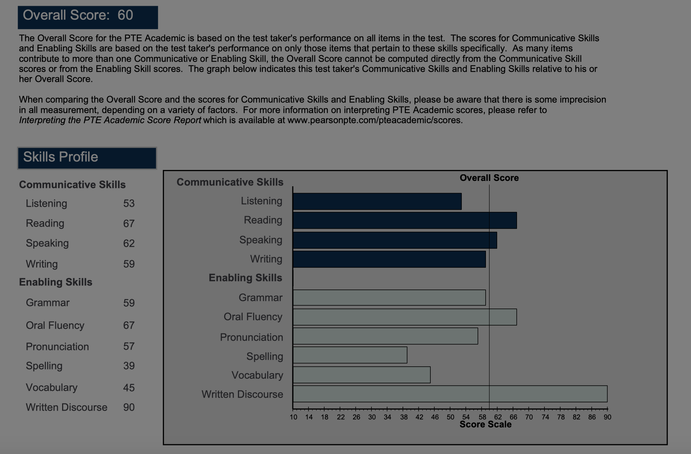

# 考试信息

1. 21 Aug, 2019

    
    
    

|   Date    | listening | reading | speaking | writing | grammar | oral  fluency | pronunciation | spelling | vocabulary | writen discourse |
| :-------: | :-------: | :-----: | :------: | :-----: | :-----: | :-----------: | :-----------: | :------: | :--------: | :--------------: |
| 2019.8.21 |    53     |   67    |    62    |   59    |   59    |      67       |      57       |    39    |     45     |        90        |
|           |           |         |          |         |         |               |               |          |            |                  |

