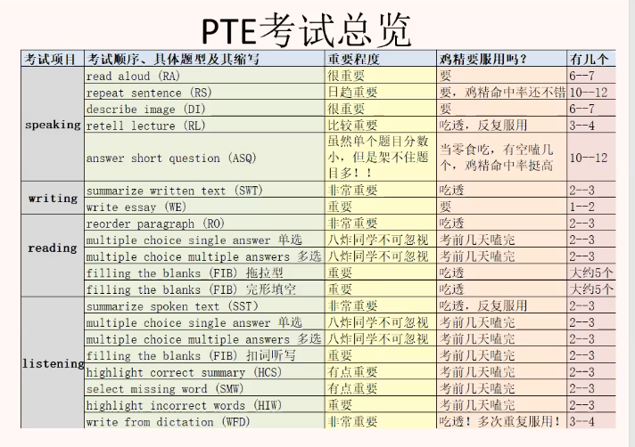

# PTE 复习计划

### 目标：八炸

### 时限：2个月

### 考试地点：

1. navitas 8楼 有小隔间 （耳机可能不稳定）
2. pearson centre 
3. Central  queensland university(早晨最好)

### 材料：

1. 黑科技：看新题

 	2. 萤火虫：练习机经
 	3. 羊驼：刷题

###  PTE考试分数比重

